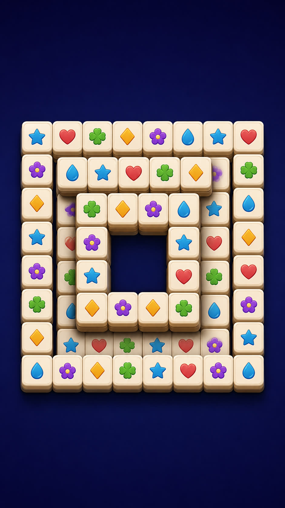
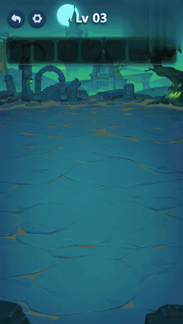

# AE & C4D Skills

After Effects 与 Cinema 4D 的 Codex Skill 集合。现在只有一份 After Effects Skill，Cinema 4D 还没有。

当前只在 **Codex 5.6 SOL**、推理深度 **extra-high** 下验证过。其他模型没有验证。

## 目录

| Skill | 软件 | 做什么 |
| --- | --- | --- |
| [ae-reference-stack-layout-render-v2](skills/ae-reference-stack-layout-render-v2/README.md) | After Effects | 按引导图改源工程里的牌堆外形，玩法仍走源工程 |

## ae-reference-stack-layout-render-v2

[说明](skills/ae-reference-stack-layout-render-v2/README.md) · [SKILL.md](skills/ae-reference-stack-layout-render-v2/SKILL.md) · [成片](docs/skills/ae-reference-stack-layout-render.html)

| 改造前 | 引导图 | 改造后 |
| --- | --- | --- |
|  |  |  |
