# 消除游戏广告素材操作

仓库：[`ae-blender-skill`](https://github.com/dongyuan21/ae-blender-skill) · 展示：[GitHub Pages](https://dongyuan21.github.io/ae-blender-skill/)

对 After Effects / Blender 设计源文件做二次创作，面向消除游戏广告素材。牌面、堆叠、特效、音效可以分开改；点击、匹配、消除和 UI 留在源工程里。

当前只在 **Codex 5.6 SOL**、推理深度 **extra-high** 下验证过。

## 分类

| 类 | 软件 | 做什么 | Skill 包 |
| --- | --- | --- | --- |
| [换牌面](#1-换牌面) | After Effects | 替换真实牌面 / 材质，玩法时间线不动 | — |
| [换堆叠](#2-换堆叠) | After Effects | 按引导图重排牌层 | [ae-reference-stack-layout-render-v2](skills/ae-reference-stack-layout-render-v2/README.md) |
| [批量生产](#3-批量生产) | After Effects | 主题 × 结构母版叉乘出成片 | — |
| [换特效](#4-换特效) | After Effects | 抽换或生成碰撞特效，绑到真实时点 | — |
| [换音效](#5-换音效) | After Effects | 按材质匹配声音，状态机对齐触发 | — |
| [Blender](#6-blender) | Blender | 3D 工程修改与渲染对照 | — |

## 1. 换牌面

在 AEP 副本里定位真实牌面，换成新图案后再渲染。牌体、阴影、堆叠、点击和消除不动。

| 目标水果牌面 | 家具 → 水果 |
| --- | --- |
| 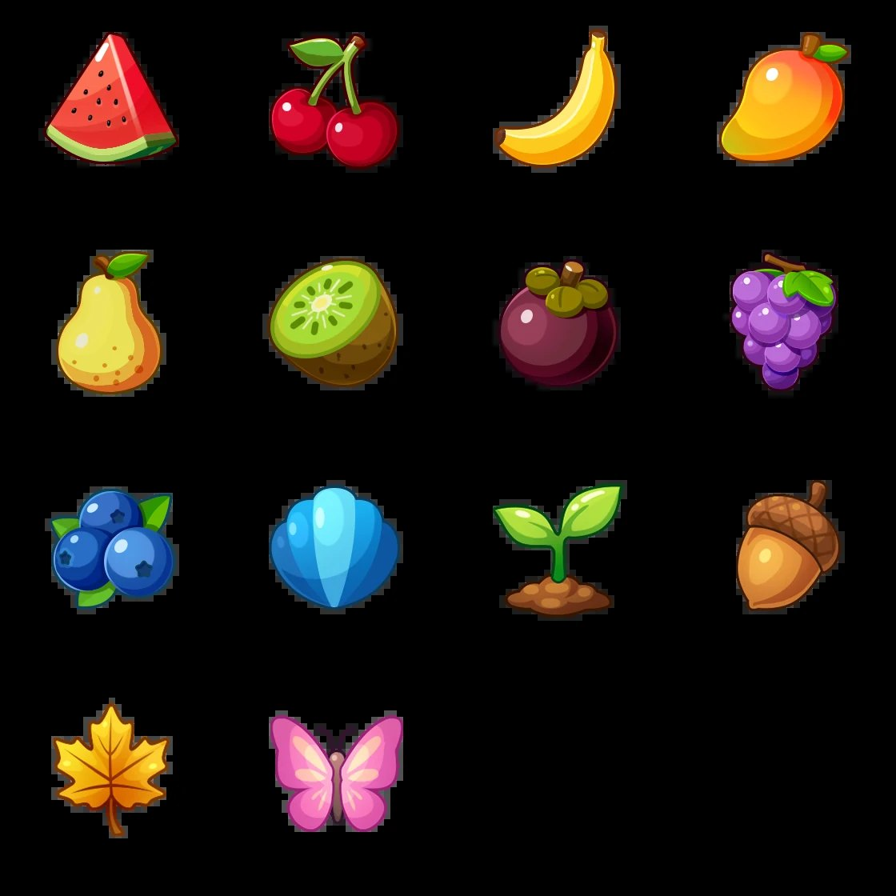 | 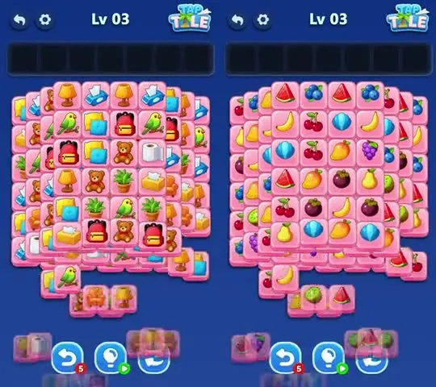 |

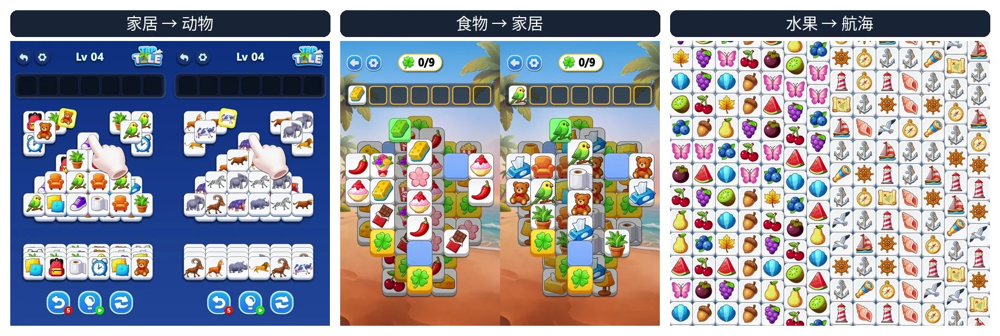

家居 → 动物、食物 → 家居、水果 → 航海。历史批次 11 个源 AEP × 12 组牌面，连同原版共 143 条。

| 麻将四版 | Mahjong 1.2 |
| --- | --- |
| 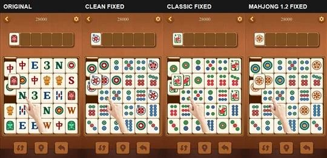 | 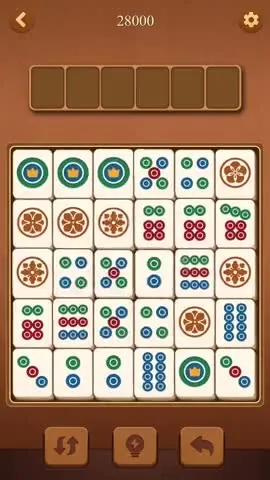 |

成片视频见 [展示页 · 换牌面](https://dongyuan21.github.io/ae-blender-skill/#tile)。

## 2. 换堆叠

参考图只定外形；源工程继续提供点击、匹配、消除和 UI。

| X 型引导图 | T 型引导图 | 沙漏引导图 |
| --- | --- | --- |
| 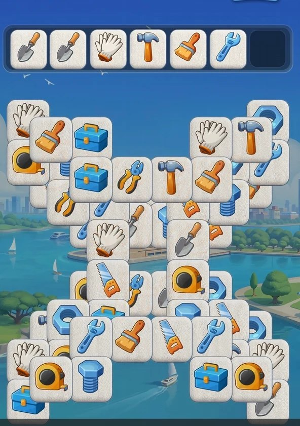 | 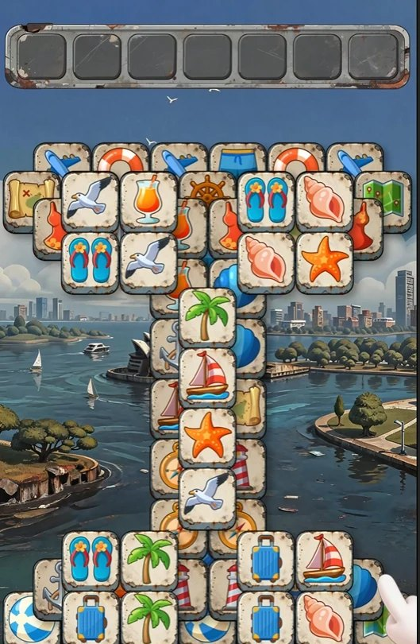 | 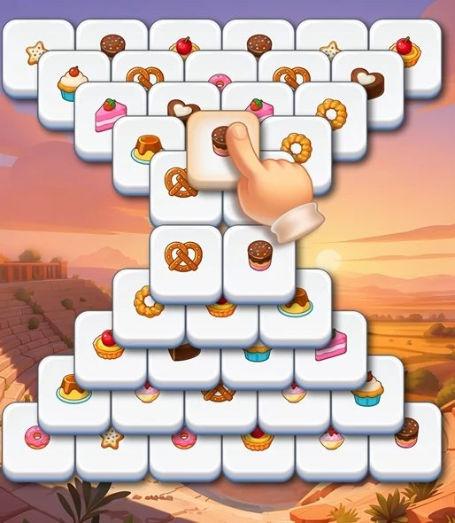 |

| X 型结果 | T 型结果 | 沙漏结果 |
| --- | --- | --- |
| 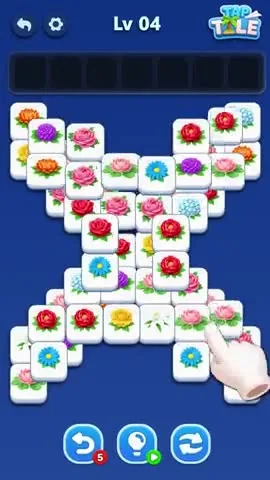 | 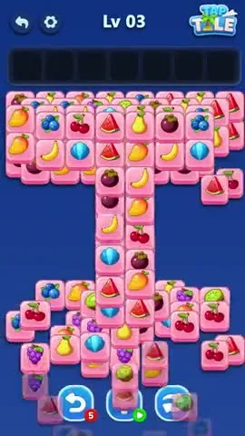 | 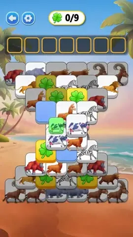 |

[说明](skills/ae-reference-stack-layout-render-v2/README.md) · [SKILL.md](skills/ae-reference-stack-layout-render-v2/SKILL.md) · [成片](https://dongyuan21.github.io/ae-blender-skill/#stack)

## 3. 批量生产

主题资产、玩法母版、堆叠结构分开准备，再自动适配、叉乘、渲染、验收。9 套主题 × 4 个结构母版 = 36 条成片；批量渲染约 19 分钟，36 / 36 完整解码通过。

| 同一结构 × 9 主题 | 同一主题 × 4 结构 |
| --- | --- |
| 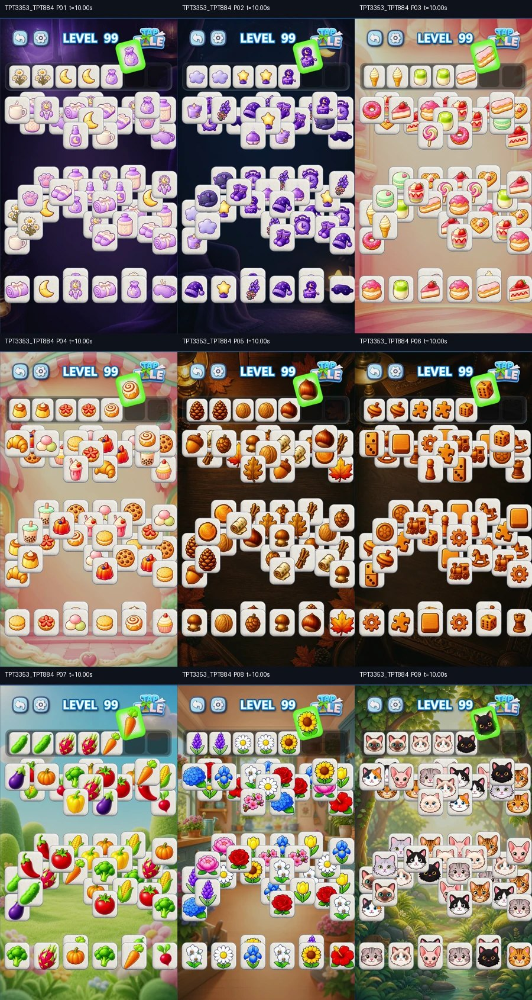 | 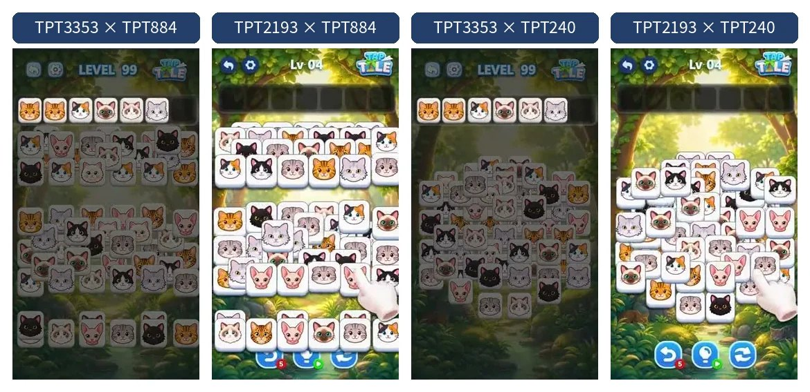 |

## 4. 换特效

抽换工程里的特效序列，或生成新的 RGBA 序列帧，绑到真实碰撞时点。

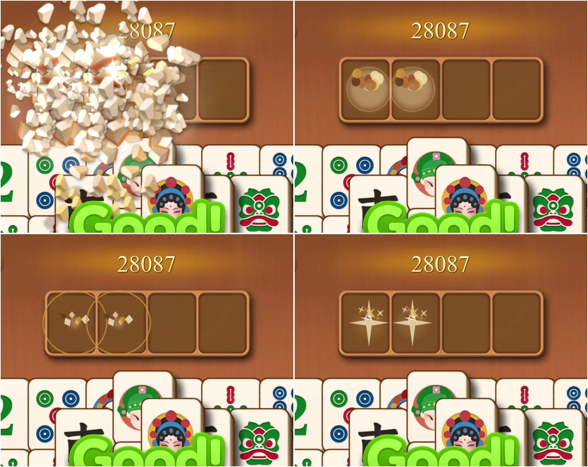

成片视频见 [展示页 · 换特效](https://dongyuan21.github.io/ae-blender-skill/#fx)。

## 5. 换音效

画面材质变了，声音也换材质。库内匹配保证底噪，生成模型补新声音，状态机管节奏。

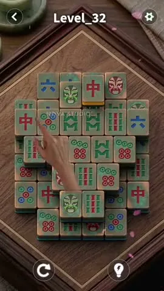

成片视频见 [展示页 · 换音效](https://dongyuan21.github.io/ae-blender-skill/#sfx)。

## 6. Blender

部分素材带真实 3D 几何、灯光和摄像机，能力从 AE 延伸到 Blender。

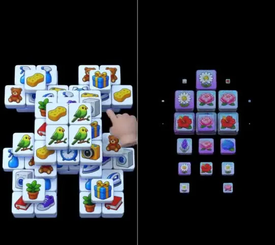

对照视频见 [展示页 · Blender](https://dongyuan21.github.io/ae-blender-skill/#blender)。

## 为什么走源文件

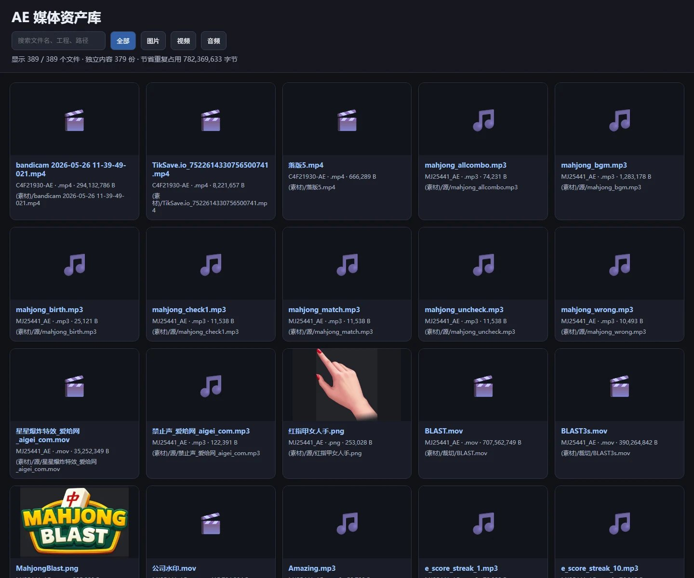

端到端视频生成还不适合当玩法局部重绘的主路径：牌面、手指、消除顺序和 UI 容易一起漂。源文件可以改指定图层，母版还能和多主题叉乘。示例库已能检索 389 个媒体文件。
