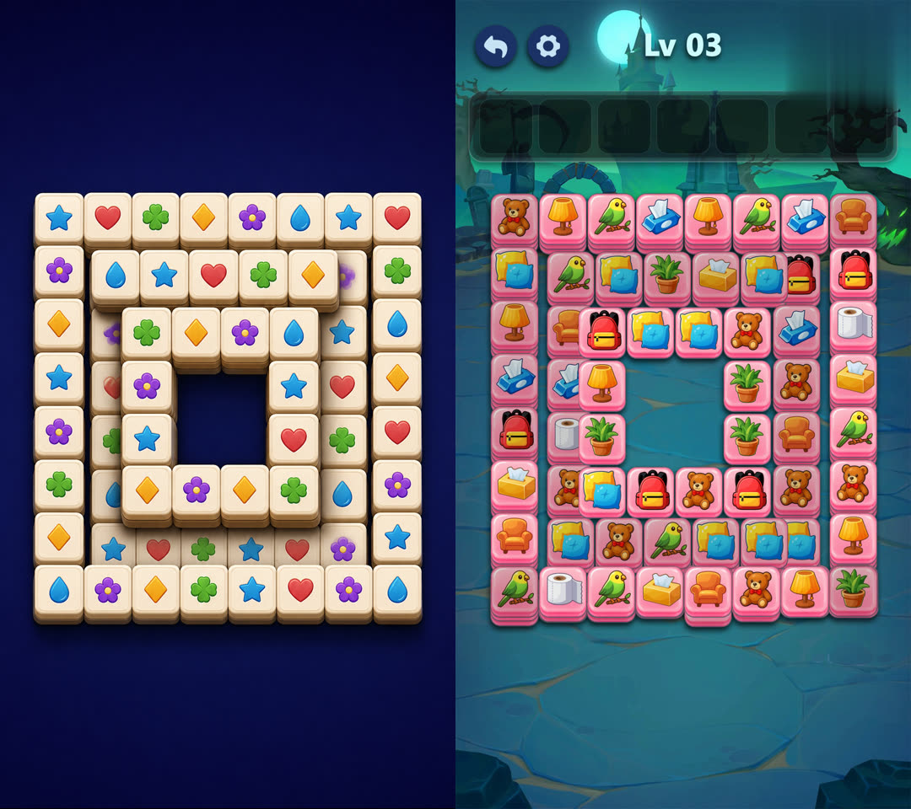

# AE Reference Stack Layout Render v2

After Effects Skill。把一张引导图里的可见牌堆，迁进一份可编辑的源工程。外形、轮廓、空洞只跟引导图；点击、匹配、消除、Mover、手势、UI、音频和最终渲染路线只跟源工程。从不去翻引导图对应的源 AEP。

只在 **Codex 5.6 SOL**、推理深度 **extra-high** 下验证过。编排说明见 [SKILL.md](SKILL.md)，成片见 [展示页](../../docs/skills/ae-reference-stack-layout-render.html)。

它不是一份大 Prompt 一次做完。运行时是状态机：源工程一条支线、引导图一条支线，汇合后再写 AE。四个东西各管一块，不能互相改：

- `source-event-model`：图层身份、layer index、入出点、点击时刻、Mover / 手势、花色与消除组
- `visible-layout`：引导图上看得见的顶面几何、轮廓、空洞、行列语法
- `capacity-plan`：源工程有多少张牌，就要有多少个物理槽位；藏在后面的层要标明是看见的、推断的，还是为多出来的牌合成的
- `assignment`：每行只能是 `{tileId, slotId}`，不能夹带 zOrder、点击时间或目标坐标

## 改造前 → 引导图 → 改造后

先是源工程原来的堆叠，再是这份任务真正要跟的引导图，最后是迁过去之后的成片。引导图只决定外形，不决定玩法。

| 1. 改造前 | 2. 引导图 | 3. 改造后 |
| --- | --- | --- |
|  |  |  |

引导图与干净渲染对照：



## 具体分几步

能力预检之后，源工程与引导图可以并行。它们只在容量协调这一步汇合。之后才能分配、模拟、写 AE、预览、出成片。

```text
INITIALIZED
  -> CAPABILITY_PREFLIGHT_PASSED
      -> SOURCE_ROUTE_LOCKED
          -> BOARD_INVENTORY_LOCKED
              -> EVENT_MODEL_LOCKED -------------------------+
      -> REFERENCE_ROI_LOCKED                                |
          -> VISIBLE_LAYOUT_LOCKED                           |
              -> DEPTH_EVIDENCE_LOCKED ----------------------+
                  -> CAPACITY_RECONCILED
                      -> ASSIGNMENT_SOLVED
                          -> SIMULATION_PASSED
                              -> PROPERTY_PLAN_FROZEN
                                  -> APPLY_READBACK_PASSED
                                      -> PREVIEW_ACCEPTED
                                          -> FULL_RENDER_PASSED
```

每一步都落成不可变 Receipt，用 CAS 提交。过期的 Worker 不能覆盖新状态。上游重新 PASS，后面的节点全部作废，必须重做。对话文本不算进度。

### 1. 初始化与能力预检

`INITIALIZED` → `CAPABILITY_PREFLIGHT_PASSED`

把源 AEP 和引导图拷进 `<library>/.staging/<run-id>`，给原文件做 Hash。之后所有 AE 操作只打这份拷贝，原工程既不打开也不保存。

预检查 Python / Pillow，以及 Windows 宿主机上的 AfterFX、ffmpeg、ffprobe。这一步只判断环境在不在，不解释工程含义。

### 2. 锁源路线，清点棋盘

`SOURCE_ROUTE_LOCKED` → `BOARD_INVENTORY_LOCKED`

只读检查 staged AEP。先锁两个角色：改的是嵌套棋盘合成；渲的是最外层包装合成。缺素材、表达式错误、水印只按这条渲染路线计。工程里的历史脏点只当证据，不是自动拦路；只有路线上新出现的关键回归才挡住晋级。

棋盘上每一个候选图层都要入册或带证据排除。点击事件不等于全部牌层：没被点到的装饰牌、垫底牌也在清单里。这一步不能决定点击时刻，也不能发明目标槽位。

### 3. 锁源事件模型

`EVENT_MODEL_LOCKED`

事件模型只抄检查结果，不预测：

- 前后关系 = AE `layerIndex`（index 越小越在前面）
- 活动区间 = `inPoint` / `outPoint`
- 点击时刻、Mover 绑定、手势偏移必须有源工程证据

`sourceFactsSha256` 在校验时重算。改任何玩法事实，这份模型和它后面的节点全部失效。模型不能为了让后面的布局好做，去改图层顺序、入出点或花色。

### 4. 锁引导图 ROI、可见布局和深度证据

`REFERENCE_ROI_LOCKED` → `VISIBLE_LAYOUT_LOCKED` → `DEPTH_EVIDENCE_LOCKED`

ROI 只圈牌堆，把手、托盘、UI、文字、背景装饰排除掉。

可见布局当成一种堆叠语法来写，不是一堆检测点。它只拥有看得见的顶面锚点：轮廓、空洞、行列、牌心和牌面尺寸。源工程有多少张牌、后面要藏多少层，这里一律不许写。

提案和复核必须拆开：提案者用一份上下文出 overlay 和作物；复核者换一份全新上下文看原图、overlay 和草稿，不能看到提案者的内部推理。自己批自己的布局不算数。

深度证据只记录看得到或站得住的前后关系、每锚点的深浅上下界。完全看不见的垫层标 `unknown`，等到容量协调再补。不能把「源工程牌比图上多」伪装成「图上看到了隐藏层」。

### 5. 容量协调

`CAPACITY_RECONCILED`

源牌数必须等于物理槽位数。看得见的顶面锚点全部保留；多出来的牌分到后面的槽，并标明：

- `observed-top-surface`
- `observed-depth`
- `inferred-depth`
- `synthesized-for-surplus`

不要把剩余牌堆在同一个回退中心，除非后续揭示和画面都支持。容量计划可以决定槽的数量和出处，但不能改已经锁死的可见外形，也不能改源事件事实。

### 6. 分配并模拟

`ASSIGNMENT_SOLVED` → `SIMULATION_PASSED`

求解器做一对一的牌到槽。模型可以写固定 / 允许 / 禁止的约束，但不能手写带玩法字段的最终映射。合法的一行只有：

```json
{"tileId": "tile-017", "slotId": "r05-c01::d2"}
```

模拟必须同时过：覆盖完整且不重复、身份一致、不出界、每次点击时前方没有挡牌、遮挡顺序不跟事件模型打架。只有 `passed` 且 `writeAuthorized: true` 才能进 Property Plan。模拟失败时禁止偷偷改上游 JSON 来「修过」。

### 7. 冻结并写入 AE

`PROPERTY_PLAN_FROZEN` → `APPLY_READBACK_PASSED`

Property Plan 是一笔事务，不是一句「把牌挪过去」。每一条都带合成 / 图层 / 素材身份、期望关键帧数量、写入前的旧值、新值、容差、路线 QA 基线和依赖锁。默认只动 Position，必要时动 Scale；默认不重排图层。同一属性的重复写入会合并，同一关键帧的冲突写入会在进 AE 之前被拒。

写入走隔离拷贝：staged 输入和输出路径必须不同。`apply_property_plan_v2.jsx` 先核对旧值再写；同一次会话里的读回不够，必须再开一次 AE，用 `verify_property_plan_v2.jsx` 重新打开输出工程核对。原 AEP 的 Hash 在整段过程中不能变。

### 8. 预览、失败回退、成片

`PREVIEW_ACCEPTED` → `FULL_RENDER_PASSED`

先出静帧、引导图对照、可见布局 / 容量 / 分配 overlay，以及每个改过的点击、Mover、手势附近的短样。预览复核同样换全新上下文。QA 只许打 typed issue，由 `route-qa` 退回 DAG 上最早那个有权修它的节点。多个问题同时出现时，退最早的那个——例如轮廓不对又点不动，要退回可见布局，而不是在分配上打补丁。QA 不准直接改 AEP。

预览通过后再渲最终包装合成。ffprobe 查元数据，ffmpeg 整段解码，并再次核原工程 Hash。全部过了才算 `FINAL`。安全可渲但外形还不够，只能停在 `CANDIDATE`，不能叫完成。

## 环境

- Python 3.10+
- Pillow
- Windows + Adobe After Effects（实际 AEP 检查/写入/渲染时）
- ffmpeg / ffprobe（最终视频 QA）
- 可选：NumPy + SciPy（Hungarian 初始分配）
- 可选：OpenCV（参考图低层像素证据）

```bash
python -m pip install -r requirements.txt
python scripts/ae_stack.py self-test
python scripts/validate_package.py
```

```bash
python scripts/ae_stack.py init-run ^
  --source-aep D:\work\source.aep ^
  --reference-image D:\work\reference.png ^
  --library D:\work\ae-stack-library
```

随后始终先跑 `state-status`，只执行当前 `eligibleNodes`，再 CAS 提交。命令见 [references/cli-reference.md](references/cli-reference.md)。

## 包内目录

```text
SKILL.md                         薄编排与权威边界
agents/openai.yaml               Codex 5.6 SOL / extra-high
agents/prompts/                  独立交接模板
scripts/ae_stack.py              统一 CLI
scripts/ae_stack_runtime/        状态、Schema、求解、模拟、QA
scripts/ae/*.jsx                 只读检查、隔离写入、fresh reopen 验证
references/                      工作流和约束
schemas/                         核心 Artifact JSON Schema
examples/hourglass-.../          Golden Fixture
tests/                           回归测试
```

Python Runtime、Golden Fixture、Schema、求解器和模拟器可以离线验证。真正打开、写入、重新打开和渲染 After Effects，必须在装了目标 AE 版本与项目依赖的 Windows 主机上做。
